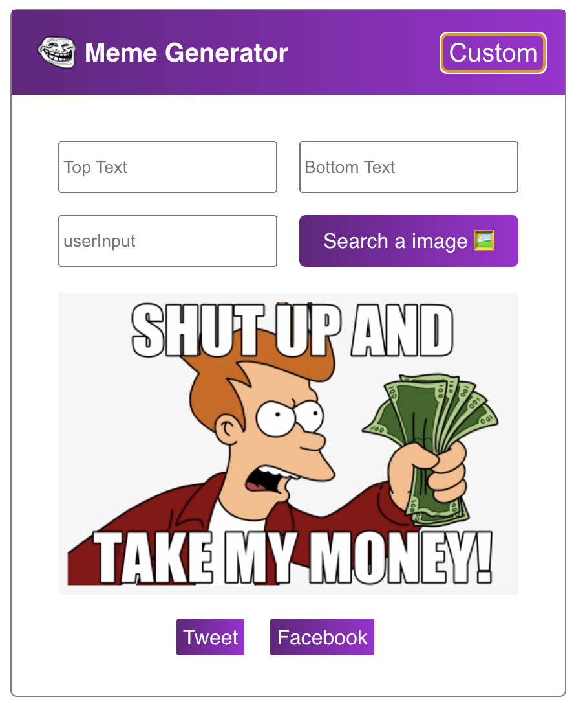
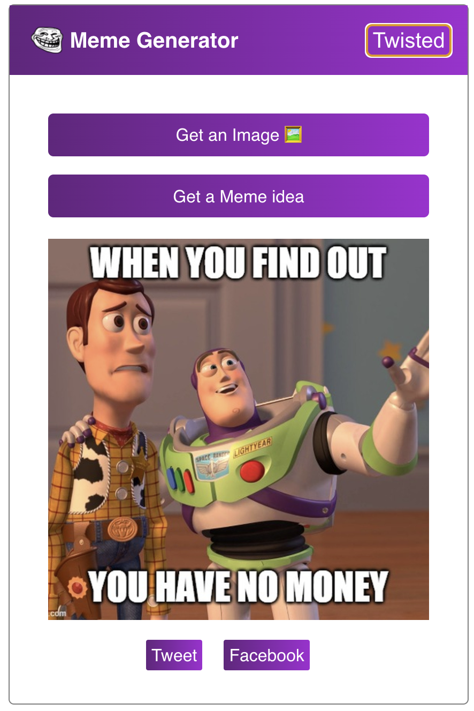

# Meme Generator

## About

This Meme Generator has two versions. Custom Version allows users to write their own words and search a picture which is linked from unsplash images. Twisted Version gives users a random picture which is generated from imgflip API and a random sentence from simpsons quote API. And then users can share the Meme to facebook or twitter.

## Demonstration

<a href='http://twisted-meme-generator.surge.sh/'>Link to website</a>

## My plan/approach

Add app functions and api work.

## Technologies used

<ul>
    <li>React</li>
    <li>HTML</li>
    <li>CSS</li>
    <li>JavaScript</li>
    <li>GitHub</li>
    <li>Surge</li>
    <li>API</li>
</ul>

## Dependencies used

<ul>
    <li>@testing-library/jest-dom": "^5.16.3</li>
    <li>@testing-library/react": "^12.1.4</li>
    <li>@testing-library/user-event": "^13.5.0</li>
    <li>axios": "^0.26.1</li>
    <li>react": "^18.0.0</li>
    <li>react-dom": "^18.0.0</li>
    <li>react-router-dom": "^6.3.0</li>
    <li>react-scripts": "5.0.0</li>
    <li>web-vitals": "^2.1.4</li>
</ul>

## Lessons I learned

<ul>
    <li>React practice</li>    
    <li>API</li>
</ul>

## Features to add in the future

Adding a drawing board to arrow users to draw a picture.
Optimize the facebook/twitter share function.
